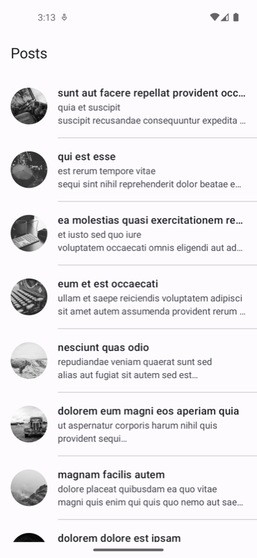
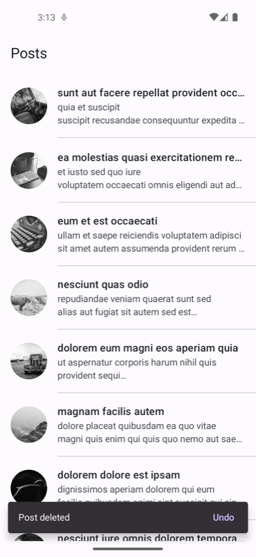
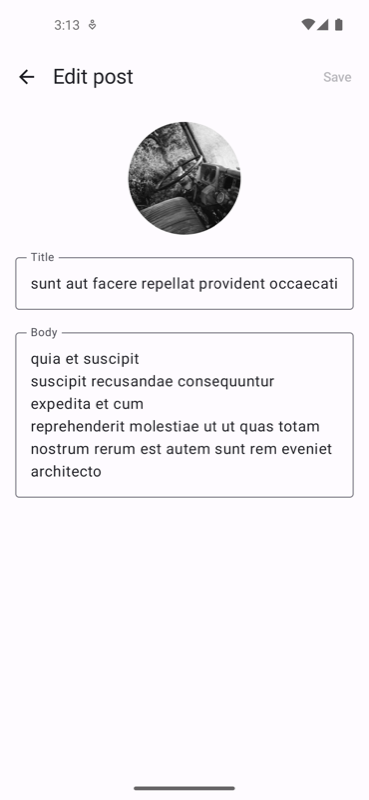
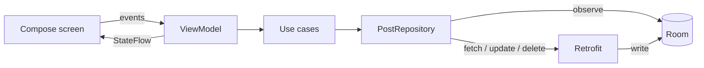

# NgamingCase

An Android app that lists posts from [JSONPlaceholder](https://jsonplaceholder.typicode.com/posts), lets you delete them with a swipe and edit their title and description.

<p>
  
  
  
</p>

## Features

- Post list with title, short description and a circular grayscale image
- Dividers between items
- Swipe to delete, with undo
- Detail screen to edit title and description
- Pull to refresh
- Cached posts are shown offline
- Loading, empty and error states with retry
- Light and dark theme

## Tech stack

| Area | Library |
|---|---|
| Language | Kotlin |
| UI | Jetpack Compose, Material 3 |
| Architecture | MVVM, unidirectional data flow, use cases |
| Async | Coroutines, Flow |
| DI | Hilt (KSP) |
| Network | Retrofit, OkHttp, kotlinx.serialization |
| Local storage | Room |
| Images | Coil 3 |
| Navigation | Navigation 3 |
| Testing | JUnit 4, MockK, Turbine, Truth, Compose UI test |
| Code quality | Detekt, Spotless (ktlint), Android Lint |

## Architecture



The UI only observes Room. The network is used to fill and update Room.

### Modules

```
:app                          Application, MainActivity
:core:common                  Result and error types, dispatcher qualifier
:core:designsystem            Theme, icons, shared labels
:core:ui                      Error to message mapping
:core:database                Room database, DAO, entity
:core:testing                 Test helpers
:network                      OkHttp, Retrofit, JSON setup
:navigation                   NavHost and Navigator, no feature routes
:feature:posts:domain         Model, repository interface, use cases
:feature:posts:data           Repository implementation, API, DTO, mappers
:feature:posts:presentation   Screens, ViewModels, routes and nav entries
```

Each feature owns its routes and registers its screens through an `EntryProviderScope` extension (`postsEntries`), so `MainActivity` only lists features and does not grow with every new screen.

Shared Gradle setup lives in `build-logic` as convention plugins. Dependencies are in `gradle/libs.versions.toml`.

## Design decisions

**Room is the single source of truth.** JSONPlaceholder accepts `PUT` and `DELETE` but never saves the changes, so a refresh would bring deleted posts back and undo edits. Deleted posts are kept as tombstones (`isDeleted`) and edited posts are flagged (`isLocallyModified`). A refresh never overwrites either of them.

**Images use the post id, not the list position.** With the position, every image below a deleted row would change. The URL (`https://picsum.photos/300/300?random={id}&grayscale`) is built in the data layer; the domain `Post` model only carries the resulting `imageUrl` and does not know where images come from.

**Delete and undo.** A swipe hides the post right away and shows a snackbar with Undo. The `DELETE` request is sent only after the snackbar closes without Undo. If the request fails, the post comes back and an error is shown.

**Update.** Save sends `PUT` first and writes to Room only if it succeeds. On failure, the entered text is kept and an error is shown. Edited text is stored in `SavedStateHandle`, so it survives rotation and process death.

**Refresh.** On first launch the list is loaded from the API. Later launches show the cache at once and refresh in the background. If a refresh fails while there is content, only a snackbar is shown.

### Requirement mapping

| Requirement | Implementation |
|---|---|
| RxJava / Coroutines | Coroutines and Flow |
| Dagger2 / Hilt | Hilt |
| Retrofit | Retrofit with kotlinx.serialization |
| MVVM | ViewModel + StateFlow, one UI state per screen |
| DiffUtil | `LazyColumn` with stable keys and immutable models |
| Divider | `HorizontalDivider` |
| Swipe to delete | `SwipeToDismissBox` |
| Detail screen | Navigation 3 destination |

## Build and run

Requirements: Android Studio (latest stable), JDK 17.

```bash
./gradlew assembleDebug
```

The API base URL is set in `gradle.properties` (`baseUrl`) and can be overridden per build:

```bash
./gradlew assembleDebug -PbaseUrl=https://example.com/
```

## Tests

```bash
./gradlew testDebugUnitTest
./gradlew connectedDebugAndroidTest
```

- Unit tests: repository, list ViewModel, detail ViewModel
- Instrumented tests: DAO with an in-memory database, list screen UI

Code quality checks:

```bash
./gradlew spotlessCheck detekt lintDebug
```

## Known limitations

- picsum.photos can return a different image for the same `random` value. Images stay the same thanks to Coil's disk cache, but may change after clearing app data.
- Deletes and edits that fail are not retried later. A WorkManager based sync queue would fix this.
- No search or pagination.
